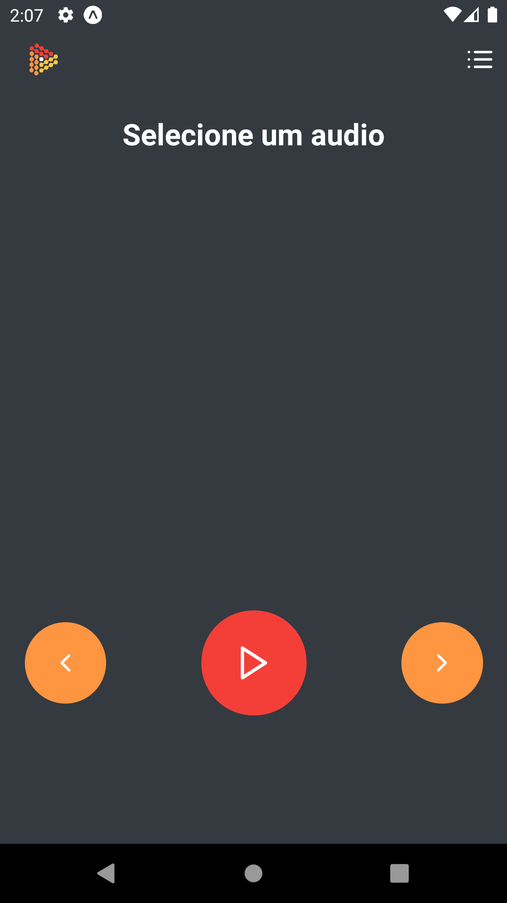
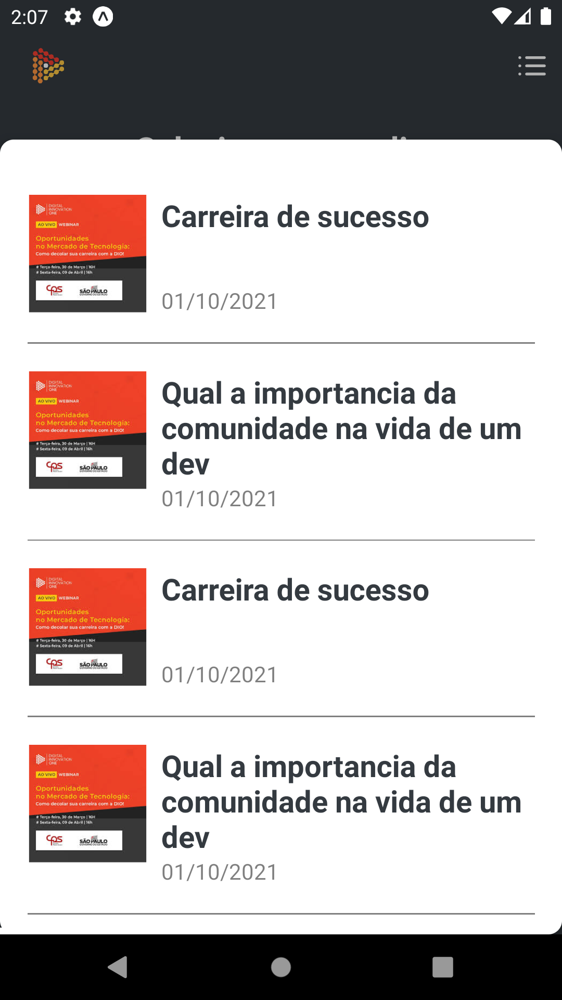
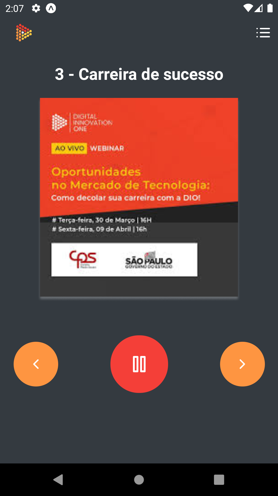

# Digital Cast
Projeto desenvolvido utilizando React Native. O App é um player de música, o qual busca uma playlist de uma api, que é simulada utilizando o json-server. 

# Captura de tela

  
  
  

# Principais recursos utilizados

- Styled Components
- Expo Audio API
- React Context API
- json-server